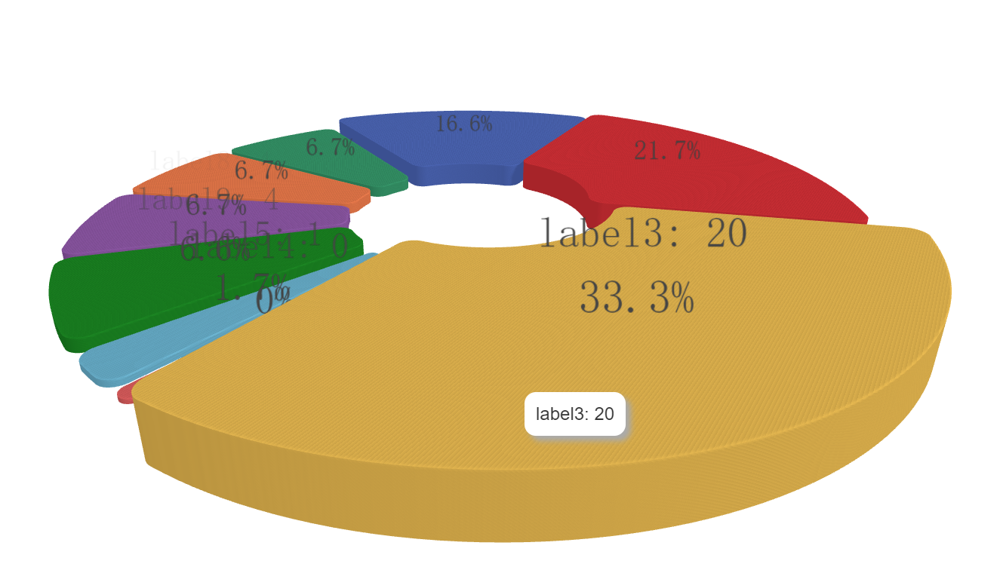
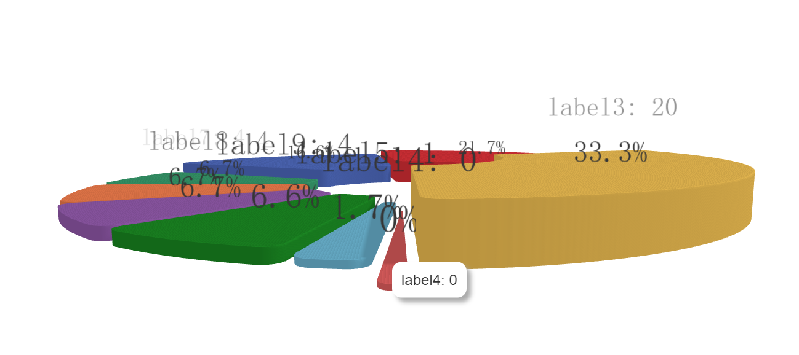
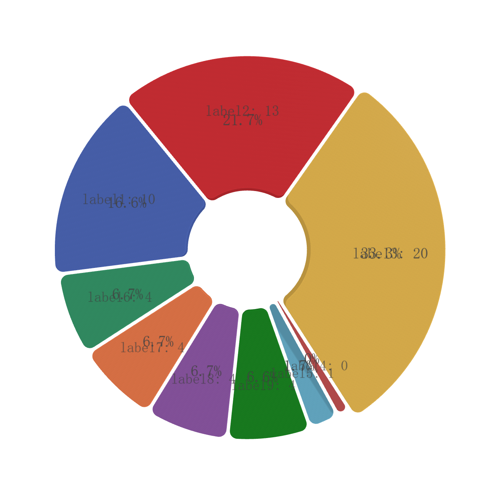

# 3d-pie

## 开始
> 拉取项目安装依赖
```bash
npm run build
```

## 截图




## TODO
- [x] 数值为0最小角度、最小高度
- [x] 优化百分比计算，根据精度最大小数排序考虑连续相同数据情况，尽可能是相同的数据相同比例
- [x] label视角跟随
- [x] label根据到观察平面距离动态修改透明度，避免多数据大面积重叠
- [x] 根据数据大小展示不同的深度depth
- [ ] 优化渲染，无更新时减少不必要渲染
- [ ] visual map
- [ ] 颜色优化

## 参考

* [react pie3d](https://github.com/pbeshai/3dpie)

<!-- ## License -->

<!-- [MIT](LICENSE). -->
